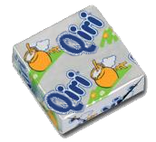

# Qiri

Rust bindings of the [Qi Framework](https://github.com/aldebaran/libqi) for robotics.
It is used for robots made by Aldebaran, such as NAO and Pepper.



This library embeds libQi and its dependencies.
It may take pretty long to compile, but it should work anywhere
-- even on the robots ;)

## Usage

Set it as a dependency of your project:

```bash
cargo add qiri
```

And check the documentation to use it.

## Cross-compilation

On Mac, for NAO:

- install the musl cross-toolchain with homebrew:

  ```bash
  brew tap messense/macos-cross-toolchains
  brew install i686-unknown-linux-gnu
  ```

- build it for the right target:

  ```bash
  CC_i686_unknown_linux_musl=/opt/homebrew/Cellar/i686-unknown-linux-musl/11.2.0/bin/i686-unknown-linux-musl-gcc \
  CXX_i686_unknown_linux_musl=/opt/homebrew/Cellar/i686-unknown-linux-musl/11.2.0/bin/i686-unknown-linux-musl-g++ \
  AR_i686_unknown_linux_musl=/opt/homebrew/Cellar/i686-unknown-linux-musl/11.2.0/bin/i686-unknown-linux-musl-ar \
  CARGO_TARGET_I686_UNKNOWN_LINUX_MUSL_LINKER=/opt/homebrew/Cellar/i686-unknown-linux-musl/11.2.0/bin/i686-unknown-linux-musl-gcc \
  cargo build --target i686-unknown-linux-musl
  ```
